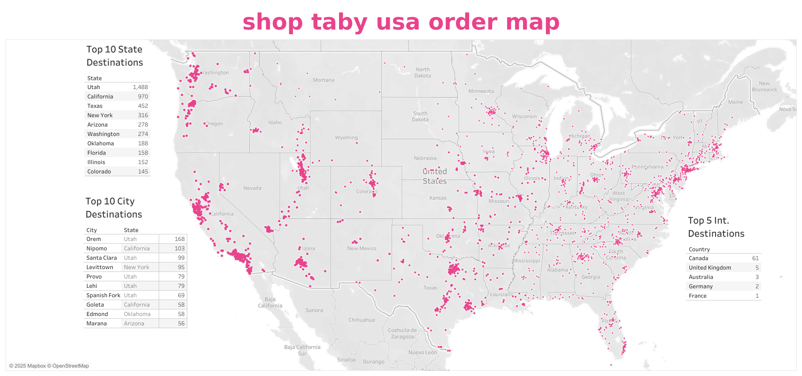

## Shop Taby USA Order Map
This is a heatmap visualization I created for a business I'm a co-owner of: [Shop Taby](https://shoptaby.com/) 

Shop Taby is a women's fashion brand championing size inclusivity founded in 2019. 

### Business Task:
Create a visualization of Shop Taby's USA orders. Include top shipping destinations by City and State, as well as top International destinations.

### Summary
Although Utah is Shop Taby's #1 destination for orders, it represents only 22.45% of USA Orders.

Shop Taby's top International destination is Canada. With all the confusion around tarrifs, it would be wise to further investigate what improvements could be made to better the sales and delivery for Shop Taby's international clients. 

### Process
* Data was pulled from Shop Taby's Shopify backend in the form of csv data (shipping label data and pos sales data) 
* Data was merged, cleaned, formatted, and some summary statistics data analysis was performed using Excel   
* After Data was cleaned and formatted correctly, Tableau was used to create a heatmap and the other summary tables Like Top City, States, and Intl. Destinations 

### Data Info
* Dataset size: 6,618 Domestic Orders and 75 International Orders
* Dataset date range: 01/01/2019 - 04/07/2025
